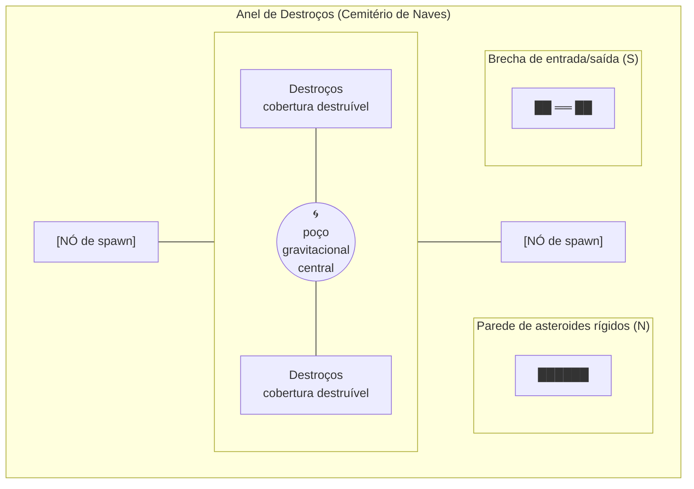

# Arena & Level Design

> [!abstract]+ Premissa
> 100% vácuo espacial, sem interiores. Geografia feita de **matéria, energia e gravidade** — nunca paredes de pedra. O espaço da demo é uma mesa de bilhar tática, não um oceano vazio.

Arena única da demo: **Cemitério de Naves**.

## Regras de level design

1. **Mosaico de densidade:** asteroides rígidos indestrutíveis formam o esqueleto (bordas, corredores, esquinas); destroços destruíveis formam cobertura temporária (HP 30–60).
2. **1 poço gravitacional central** por arena de combate: curva tiros do jogador e do inimigo + deriva leve da nave. É a "geografia invisível" — permite acertar por tabela atrás de cobertura (ver momento-alvo em [[docs/Visão & Pilares]]).
3. **360° twin-stick sempre:** nenhum corredor mais estreito que 3 larguras de nave; sem beco sem saída.
4. **Objetivos variam por arena:** Eliminação de enxame / Sabotagem de geradores (3–4 nós) / Sobrevivência de 60 s. Revezar para forçar rebuilds diferentes.
5. **Interagíveis (2 na demo):**
   - **Rocha Eletrostática** — arma elétrica a carrega por 10 s; ela zapa proximidade.
   - **Cristal de Refração** — feixe contínuo vira 4 radiais de 90° (sinergia com [[Emissor de Feixe Fóton]]).
6. **Juice espacial obrigatório:** parallax 3 camadas + carcaças de naves ao fundo para escala; nunca fundo preto liso.

## Arquétipo da demo — "O Anel de Destroços"

## Padrões proibidos

> [!fail] Lista negra de arena
> - Tela 100% vazia (sem cobertura, sem poço, sem interativo).
> - Chokepoint intransponível sem build específica (toda arena zerável com build inicial).
> - Neblina que esconda projétil inimigo (névoa só reduz lock-on, nunca esconde bala).
> - Dano inevitável de spawn (inimigos nascem nas bordas com 1 s de telegrafada).
> - Mais de 1 poço gravitacional por arena na demo (ilegível).
