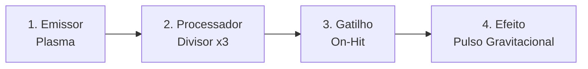

# Sistemas (WPM · Calor · Recuo · Loop de Run)

## Sistemas de Combate

**Movimentação vetorial twin-stick:**

- Analógico esquerdo (ou WASD): vetor de impulso dos propulsores. Movimento com inércia leve, sem física escorregadia punitiva.
- Analógico direito (ou mouse): mira livre 360°. Disparo contínuo enquanto segurar.
- Quem move o jogador são **propulsores + dash**. Nada mais. Recuo de arma nunca substitui locomoção (ver [[Decisões#D-03 · Identidade vs Magicraft — diferenciais oficiais|D-03]]).

**Propulsores + dash com i-frames ([[Vektor-9]]):**

| Parâmetro | Valor demo |
|---|---|
| Velocidade base | 320 px/s |
| Dash: distância / duração / i-frames | 180 px / 0,16 s / 0,20 s (i-frame cobre dash + 0,04 s) |
| Cargas de dash | 2 |
| Recarga por carga | 1,5 s (independente, sequencial) |
| Dash atravessa | Projéteis inimigos e enxame leve; NÃO atravessa asteroide rígido nem borda |

- Dash é botão de pânico cirúrgico para poluição visual de bullet hell duplo, não ferramenta de viagem.
- Sem upgrade de dash na demo (tolerância térmica e HP variam só via Sistema de Bordo).

**Legibilidade / juice (regras obrigatórias, estilo Nova Drift):**

1. Hierarquia de projéteis: tiro inimigo = núcleo quente + anel contrastante (magenta/vermelho); tiro jogador = ciano/branco. Nunca inverter.
2. Trilhas: todo projétil do jogador deixa trilha curta (0,15–0,25 s); inimigos elite/mini-boss deixam trilha longa para leitura de padrão.
3. Hitstop: 40–60 ms em morte de elite e em acerto de mini-boss com dano alto; nunca em tiro comum.
4. Screen shake: proporcional a explosões (máx 6 px, decaimento 0,2 s); desligável nas opções.
5. Grid parallax: fundo com 3 camadas (estrelas distantes, nebulosa, grade próxima) para dar noção de velocidade no vazio.
6. Flash de overheat: borda da tela pulsa laranja + som de válvula antes do desarme — morte por overheat nunca pode ser surpresa.
7. Teto de partículas: 400 ativas; projéteis têm prioridade sobre faíscas decorativas.
8. O jogador nunca é engolido pelos próprios efeitos: explosões do jogador têm core transparente e alpha/intensidade **menor** que projéteis inimigos (confronto Level Up, [[Decisões#D-09 · Confronto com Level Up!|D-09]]).

---

## Matriz WPM

- Cada **Módulo de Arma** tem sua própria Matriz WPM independente (slots, custo térmico e recuo próprios).
- Demo: Vektor-9 tem **2 Módulos de Arma** (hardpoint frontal + traseiro), cada um com **4 slots**.

- **Fluxo esquerda → direita:**
    - Slot 1 deve ser um Emissor (se vazio, o Módulo não dispara).
    - Processadores modificam tudo à esquerda deles no mesmo Módulo.
    - Gatilho bifurca: o que vier depois dele só executa quando a condição dispara (ex.: [[On-Hit]] cria pulso no ponto de impacto).

> [!important]+ Edição livre a qualquer momento (regra travada — [[Decisões#D-01 · Fantasia de poder — modelo híbrido|D-01]] · layout em [[Decisões#D-10 · Layout de HUD — referência Magicraft|D-10]])
> A WPM **não é um menu que abre**: a cadeia vive permanentemente na HUD como **linhas numeradas por hardpoint** (barra fina estilo wand do Magicraft, ver [[docs/HUD & UX]]). Edição = **drag & drop direto no slot** (≤2 ações, ≤3 inputs totais). Slot vazio = fail-soft, cadeia executa até ali. O jogo **nunca pausa** — o caos do bullet hell disciplina a tentação de editar sob fogo.

- **Custo térmico:** cada Componente soma °C/s ao Módulo. Readout inline na própria linha do hardpoint: `°C/s 22 · 4,2s→OH` (sempre visível — nunca escondido em painel).
- **Simulador holográfico:** existe apenas na **Oficina** (sala tipada) — alvos holográficos, teste sem calor real, alerta vermelho se overheat em <2 s. Fora da HUD de combate.

---

## Energia, Calor & Recuo

**Modelo do reator (demo):**

- Barra única de calor 0–100. Taxa passiva de resfriamento: 25/s (sem atirar). Atirar soma a taxa do(s) Módulo(s) ativo(s).
- **Overheat:** ao bater 100, ambos os Módulos desarmam por **2,5 s** (ventoinha forçada + faísca), depois retorna a 40. Gatilhos [[On-Overheat]] disparam exatamente nesta janela.
- Jogador deve sempre saber o tempo até overheat — número explícito na HUD e na WPM.
- Sem mana, sem munição. Calor é o único governor de DPS.

**Perfil de recuo por Módulo de Arma (impulso tático):**

- Cada Módulo de Arma tem vetor de recuo oposto à direção do tiro, com magnitude fixa (leve/médio/pesado).
- Usos intencionais: **freio de emergência** (atirar para frente para frear deriva), **deslocamento fino** (ajuste de 10–30 px para sair de espiral de balas), **manobra traseira** (torre traseira empurra para frente).
- Recuo aplica impulso instantâneo com decaimento rápido (0,3 s), não aceleração sustentada.

> [!danger]+ Trava anti-locomoção
> - Recuo NUNCA rivaliza com propulsores + dash como fonte de movimento. Magnitudes calibradas para no máximo **15% da velocidade do dash**.
> - Proibido: builds de "motor a bala" (sustentar voo só com tiro), Processador que converta recuo em propulsão contínua, ou tutorial sugerindo recuo como viagem.
> - Playtest deve confirmar: dash + propulsores respondem por >90% do deslocamento por arena.

---

## Loop de Run & Exploração

**Portais tipados (pós-limpeza) — [[Decisões#D-07 · Loop de loot e portais|D-07]]:** após limpar cada arena abrem **2–3 portais** com ícone e rótulo. Tipos da demo:

| Portal | Conteúdo |
|---|---|
| **Componentes** | Arena de enxame; drop garantido de 2 Componentes no chão |
| **Oficina** | Bancada: re-rolar 1 Componente por Sucata / remover 1 Gatilho grátis |
| **Loja** | Comprar 1 Módulo de Arma ou 2 Componentes por Sucata |
| **Reparo** | Restaura 50% HP + resfriamento instantâneo; sem combate (1x por run) |

**Fontes de loot (travado):**

- **Componentes:** dropam no chão de asteroides destruídos e inimigos comuns dentro da arena; recolher após limpar (magnetismo de coleta: [decisão pendente — não implementar na demo]).
- **Módulos de Arma completos:** drops raros e marcantes de elites ([[Elite Cobrador]]), do mini-boss e da loja. Nunca de inimigo comum.
- **Sistemas de Bordo:** salas de recompensa e baús (1 por run na demo, escolha 1 de 2).
- **Sucata Nanotecnológica:** moeda intra-run; some ao morrer (sem meta).

> [!note]+ O que NÃO existe na demo (cortes explícitos)
> Meta-progressão, Estação-Mãe, mapa de setores estilo FTL, naves modulares (só Vektor-9), chassi extras, chefes multifase, nebulosas elementares, biomas adicionais.

---

## Critérios de Validação da Demo

1. Novo jogador monta a 1ª build funcional em <5 min sem tutorial em vídeo (só tooltips + simulador holográfico).
2. Morte por overheat/autoengenharia é percebida como justa e engraçada (≥4 de 5 playtesters riem ou citam a mensagem de morte corretamente).
3. Recuo usado intencionalmente pelo menos 1x por run em playtest (freio/deslocamento fino observável ou autorrelatado).
4. Edição livre de WPM é usada de verdade, não só tolerada: ≥1 edição sob fogo em ≥50% das runs de playtest. FALHA tanto se o jogador nunca editar (edição inútil) quanto se editar sempre impunemente (caos não disciplina).
5. Tempo até overheat sempre legível: jogador prevê overheat com <1 s de erro em teste de estimativa.
6. Nenhuma arena zerada só com build inicial sem dash (dash é obrigatório, build inicial é insuficiente — força engenharia).
7. Mini-boss derrotado por ≥2 arquétipos de build distintos (ex.: espiral curva vs. mina + On-Hit) — prova de solução por engenharia.
8. Sessão média 12–20 min até o mini-boss; taxa de conclusão ≥30% sem frustração reportada como "injusta".

---

## Backlog Pós-Demo

Tudo cortado da demo, com origem no [[AstraCraft - brainstorm]]:

| Item cortado | Origem no brainstorm | Nota de retorno |
|---|---|---|
| Mapa FTL de setores (malha setorial, rotas ramificadas, pressão territorial) | § "Malha Setorial estilo FTL/Star Fox" + "Salto Hiperespaço / escolha de rotas" | Reintroduzir com portais tipados como nós |
| Estação-Mãe "A Vanguarda" + meta-progressão (Núcleos de Matéria Escura) | § "Estação-Mãe / Oficina / Laboratório / Reator Central" | Só após validar loop de run |
| Chassi Gigante de Ferro (1 slot mestre, 8 encadeados, tanque) | § "Encouraçado Gigante de Ferro" | Testa fantasia oposta ao Vektor-9 |
| Chassi Hivemind (3 slots de drones orbitais) | § "Fragmentadora Hivemind" | Exige IA orbital; custo alto |
| Nebulosas elementares (gás volátil, eletromagnética) | § "Nebulosas Elementares" + "Bolsões de Gás Volátil" | Risco de ilegibilidade; validar poço único antes |
| Chefes multifase — Dreadnought "Dissonância Estelar" | § "Dissonância Estelar Fase 1/2" | Demo usa mini-boss de fase única |
| Biomas adicionais (Cinturão Volátil, Complexo Industrial, Fronteira da Singularidade) | § "Setor 2/3/4" | Cemitério de Naves é o único bioma demo |
| Módulos quânticos (Loop Infinito, Inversão Vetorial, Refletor Metamaterial) | § "Módulos de Alteração Quântica" | Quebram balanço térmico; pós-validação |
| Dash modulável (Dash Explosivo / Fase / Gravitacional) | § "Dash como slot de modificadores" | Manter dash puro na demo |
