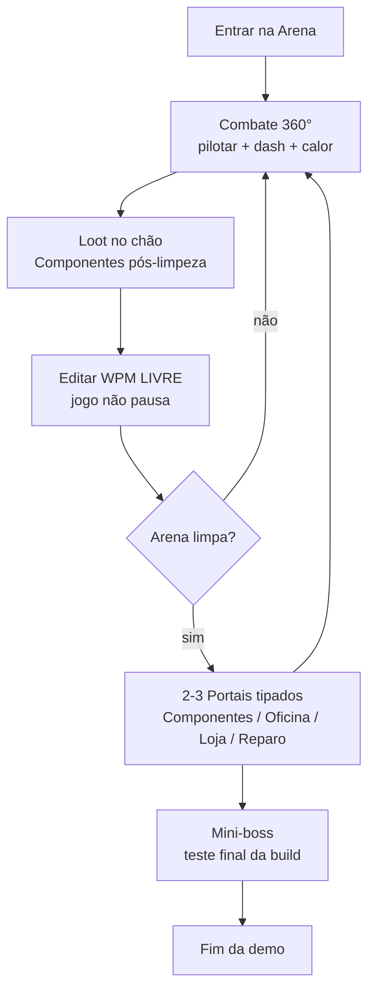

# Visão & Pilares

> [!vision]+ Frase de visão
> **Um twin-stick shooter espacial onde você pilota a arma que você mesmo projetou — e morre pela arma que você mesmo projetou.**

> [!quote]+ Tagline oficial
> *"Cada bala é projeto seu. Cada morte foi culpa do engenheiro."*
> Alternativa EN: *"Build the gun. Break the galaxy."* (ver [[Decisões#D-02 · Tagline|D-02]])

## Fantasias de poder (modelo híbrido)

| Fantasia | Camada | Descrição |
|---|---|---|
| **Primária — Engenheiro** | Minuto a minuto | Projetar, encadear e depurar builds na Matriz WPM entre e durante combates. |
| **Secundária — Executor** | Segundo a segundo | Pilotar, mirar em 360°, gerenciar calor e desviar de bullet hell com dash preciso. |

> [!success]+ Momento-cereja
> A frase que o jogador deve dizer: ***"Minha engenharia resolveu a execução."***

## Pilares (ranqueados)

| # | Pilar | Regra de ouro |
|---|---|---|
| 1 | **Engenharia resolve execução** | Todo gargalo de combate tem pelo menos uma resposta de build, não só de reflexo. |
| 2 | **Caos legível** | Bullet hell duplo (inimigo + jogador) jamais vira ruído: hierarquia visual rígida. |
| 3 | **Calor é o custo da ambição** | Não há limite arbitrário de poder; há superaquecimento. Build quebrada = build quente. |
| 4 | **Morte engraçada é morte justa** | Toda morte gera veredito legível (o que matou, qual Componente/Gatilho causou) + piada. Fundamento (Rogers, Level Up L3/L13 — [[Decisões#D-09 · Confronto com Level Up!|D-09]]): a morte precisa *significar* algo e nunca ser injusta — nosso veredito é a telemetria que ensina; a piada é a embalagem que faz a lição descer. |

> [!note]+ HUD
> O layout da HUD (linhas numeradas de WPM por hardpoint, barras HP/Calor, coluna de Sistemas de Bordo) está especificado em [[docs/HUD & UX]].

## Core Loop da Demo

**Descrição:** o jogador entra na arena, sobrevive ao combate twin-stick gerenciando calor e dash, recolhe Componentes dropados no chão, reedita a Matriz WPM quando quiser (inclusive sob fogo), limpa a arena e escolhe 1 de 2–3 portais tipados. Repete até o mini-boss. Não há hub, mapa ou meta-progressão na demo.

> [!example]+ Momento divertido-alvo (~30 segundos)
> Você entra numa arena com cobertura destruível e um poço gravitacional central. Sua build atual não perfura a cobertura. Sob fogo, você abre a WPM, troca um Processador por [[Lente de Trajetória Curva]], fecha, atira de raspão no poço — os tiros dobram a curva, contornam a rocha e limpam o enxame por trás. Você toma 1 de dano no processo e ri. Isso é AstraCraft em 30 segundos: **diagnosticar, reeditar sob pressão, ver a física validar a ideia.**

## Glossário Oficial

Usar EXATAMENTE estes termos em todo design, UI e código (tradução Magicraft → AstraCraft, ver [[Decisões#D-06 · Nomenclatura oficial (glossário)|D-06]]):

| Termo AstraCraft | Descrição (1 linha) |
|---|---|
| **Chassi** | Define HP, velocidade, dash, tolerância térmica e nº de hardpoints. |
| **Hardpoint** | Ponto de montagem no Chassi com posição e orientação (frente/traseira/lateral). |
| **Módulo de Arma** | Frame acoplado a um hardpoint; possui Matriz WPM independente com slots e custo térmico próprios. |
| **Componente** | Peça encaixada no Módulo de Arma; tipos: Emissor, Processador, Gatilho. |
| **Emissor** | Componente que gera o projétil/efeito base (plasma, míssil, feixe, mina). |
| **Processador** | Componente que altera trajetória/comportamento (multishot, curva, perfuração, ricochete). |
| **Gatilho** | Componente condicional que dispara o próximo efeito (On-Hit, On-Overheat, On-Dash). |
| **Sistema de Bordo** | Bônus passivo permanente na run; irremovível após instalado. |
| **Matriz WPM** | Grade ordenada esquerda→direita onde Componentes são encadeados por Módulo de Arma. |
| **Calor / Reator** | Recurso térmico: atirar gera calor; overheat desarma temporariamente. |
| **Sucata Nanotecnológica** | Moeda intra-run para loja e oficina. |

> [!danger] Proibido
> O termo de fantasia antigo para frame de montagem. Sempre usar **Módulo de Arma**.
